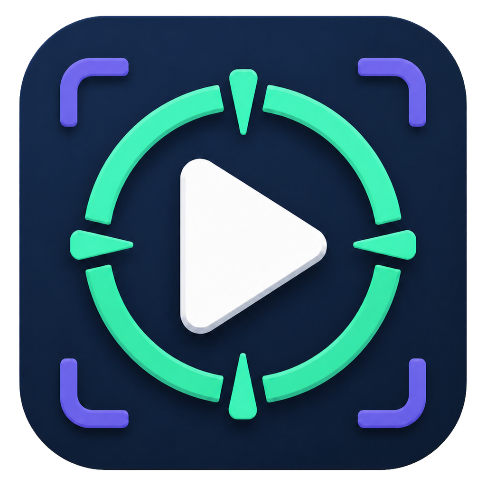
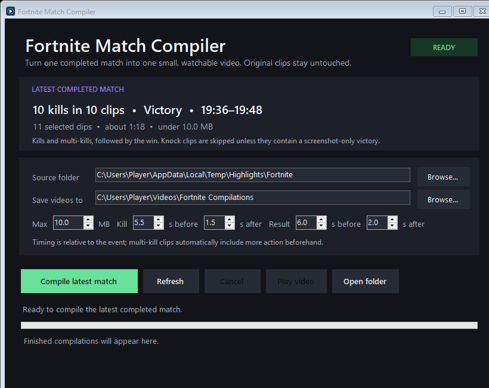

<p align="center">
  
</p>

<h1 align="center">Fortnite Match Compiler</h1>

<p align="center">
  Turn one completed match into one small, watchable video.
</p>

<p align="center">
  <a href="https://github.com/MrCreeper8/fortnite-match-compiler/actions/workflows/ci.yml"></a>
  <a href="https://github.com/MrCreeper8/fortnite-match-compiler/releases/latest"></a>
  <a href="LICENSE"></a>
</p>

Fortnite Match Compiler detects the latest completed NVIDIA Highlights match, keeps the kill moments and final result, and encodes them as one MP4 beneath a configurable size limit. Scanning and encoding happen entirely on your Windows PC.



## Highlights

- Groups NVIDIA kill highlights into completed matches.
- Includes the final Victory or Eliminated moment.
- Skips knock-only clips so the compilation stays focused.
- Supports English and German NVIDIA event labels.
- Lets you tune the maximum file size and clip timing.
- Keeps extra context for multi-kill highlights.
- Reads the original recordings without moving, modifying, or deleting them.
- Performs all scanning and encoding locally, with no telemetry or uploads.

## Requirements

- Windows 10 or Windows 11.
- NVIDIA Highlights enabled for Fortnite.
- `ffmpeg.exe` and `ffprobe.exe` from [FFmpeg](https://ffmpeg.org/download.html).

The packaged release includes the .NET runtime, but it does not redistribute FFmpeg. The app looks for FFmpeg in this order:

1. The file specified by the `FFMPEG_PATH` environment variable.
2. `ffmpeg.exe` and `ffprobe.exe` beside the app.
3. A system FFmpeg installation or an entry on `PATH`.

## Quick start

1. Download the latest Windows ZIP from the repository's **Releases** page.
2. Extract the ZIP to a folder you control.
3. Make sure FFmpeg and ffprobe are available using one of the methods above.
4. Open **Install.cmd**.
5. Open **Fortnite Match Compiler** from the Desktop or Start Menu. Opening the normal app only scans for the latest match; compilation starts when you press **Compile latest match**.
6. Check the detected match, adjust the settings if needed, and select **Compile latest match**.

For an intentional one-action compile, use **Compile Latest Fortnite Match** from the Start Menu. Its explicit name distinguishes it from the normal app shortcut.

The installer works per user, does not require administrator access, and installs the app under `%LOCALAPPDATA%\Programs\Fortnite Match Compiler`.

Community releases are not currently code-signed, so Windows SmartScreen may show an **Unknown publisher** warning on first launch. Only continue when the ZIP came from this repository's Releases page; each release also includes a SHA-256 checksum file for verification.

To use the app without installing it, open **Fortnite Match Compiler.exe** directly from the extracted folder. For one-action portable operation, open **Compile Latest Match.cmd**. It starts the same app and queues the latest completed match automatically.

## Uninstall

Open **Uninstall Fortnite Match Compiler** from the Start Menu folder, or run **Uninstall.cmd** from an extracted release package.

Uninstalling removes the installed executable and shortcuts. It deliberately keeps finished compilations, settings, history, and logs. If desired, the local application-data folder can be removed separately after reviewing its contents.

## Default locations

The defaults are resolved for the current Windows account; no user-specific paths are built into the app.

| Purpose | Default |
| --- | --- |
| NVIDIA highlights | `%TEMP%\Highlights\Fortnite` |
| Finished compilations | Your Videos folder, under `Fortnite Compilations` |
| Settings, history, and log | `%LOCALAPPDATA%\FortniteMatchCompiler` |

Both the highlights folder and output folder can be changed in the app.

## Match detection

The app reads the event labels and timestamps in NVIDIA highlight filenames. A match is considered complete after a Victory or Eliminated marker appears. Highlights after the most recent completed match are left alone until their own result marker is saved.

The detector recognizes single-, double-, triple-, and quad-elimination labels in English and German. Knock highlights are excluded unless one is the only nearby video available for a screenshot-only victory.

This filename-based approach is fast and private, but it depends on NVIDIA's expected naming format. It does not analyze gameplay frames or infer events from the video itself.

## Timing and file size

The controls in the app let you choose:

- How much context to retain around each kill.
- How much of the final match result to keep.
- The maximum output size in decimal megabytes.

The compact defaults keep **5.5 seconds before and 1.5 seconds after each kill**, plus **6 seconds before and 2 seconds after the final result**. NVIDIA clips usually retain several seconds after the event, so anchoring the excerpt around the event preserves the fight while removing most of the idle aftermath.

Multi-kill clips receive additional time automatically. The encoder adjusts resolution and bitrate as needed and verifies that the finished MP4 is strictly below the selected limit.

Shorter excerpts leave more bitrate available for each second of video. Longer excerpts preserve more context but may require a lower resolution to stay within the same size limit.

## Privacy

Fortnite Match Compiler has no account system, analytics, telemetry, cloud processing, or automatic upload feature. It launches local FFmpeg processes and writes only to the selected output folder and its local application-data folder.

The troubleshooting log can contain local paths and NVIDIA filenames. Review and redact it before attaching it to a public issue.

## Command line

Start the app and queue the latest completed match:

```powershell
& '.\Fortnite Match Compiler.exe' --compile-latest
```

Point the app to a particular FFmpeg executable:

```powershell
$env:FFMPEG_PATH = 'C:\path\to\ffmpeg.exe'
```

For isolated testing or portable application data, set `FORTNITE_COMPILER_DATA_DIR` to a writable directory before starting the app.

## Build from source

Install the [.NET 8 SDK](https://dotnet.microsoft.com/download/dotnet/8.0), then run:

```powershell
dotnet restore FortniteMatchCompiler.sln
dotnet build FortniteMatchCompiler.sln --configuration Release --no-restore
dotnet run --project tests/FortniteMatchCompiler.Tests/FortniteMatchCompiler.Tests.csproj --configuration Release --no-build
```

Run the desktop application from the source tree with:

```powershell
dotnet run --project src/FortniteMatchCompiler/FortniteMatchCompiler.csproj
```

FFmpeg is required to create a compilation, but it is not required merely to compile the C# project.

## Troubleshooting

- Confirm that the source folder exists and contains NVIDIA Fortnite highlight files.
- Wait a few seconds after a match ends so NVIDIA can finish writing the result clip.
- Confirm that both `ffmpeg.exe` and `ffprobe.exe` are available.
- If SmartScreen appears, verify that the download came from this repository and that its SHA-256 hash matches the published checksum before choosing **More info → Run anyway**.
- Check `%LOCALAPPDATA%\FortniteMatchCompiler\compiler.log` for a local diagnostic message.

Please redact personal paths and filenames before posting logs publicly.

## Unofficial project

This is an unofficial community project. It is not affiliated with, endorsed by, sponsored by, or associated with Epic Games or NVIDIA. Fortnite, NVIDIA, GeForce, and other product names and trademarks belong to their respective owners.

## License

The source code is available under the [MIT License](LICENSE).
